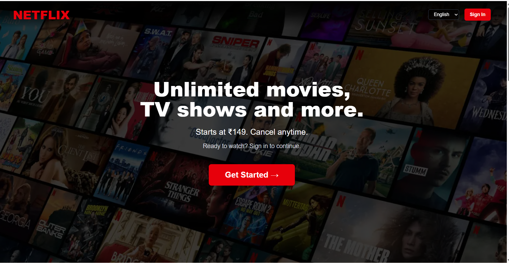
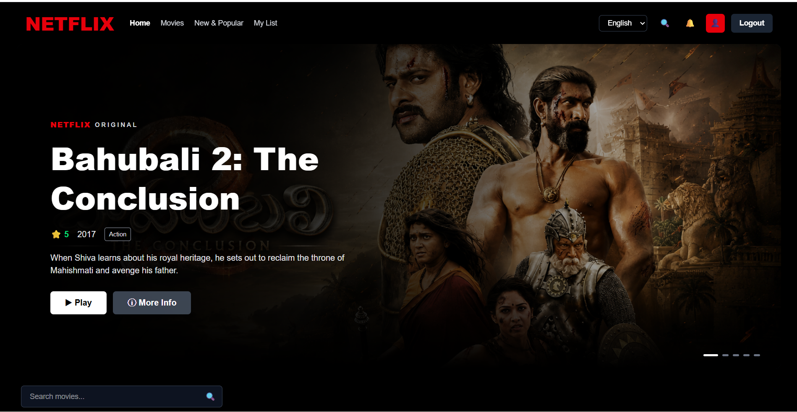
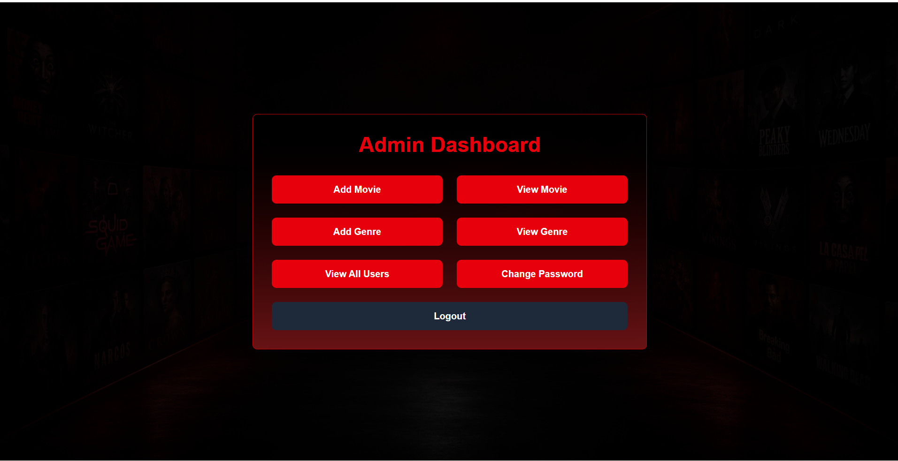
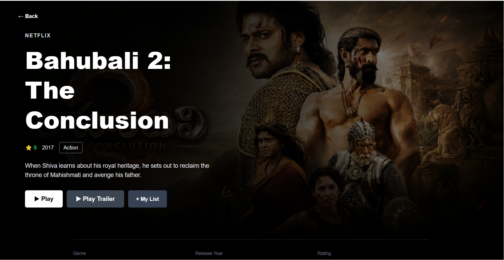

# 🎬 Netflix Clone

A full-stack Netflix-inspired OTT streaming web application built using **React, Node.js, Express.js, MongoDB, Prisma ORM, and Tailwind CSS**.

The application provides separate **User** and **Admin** modules with authentication, movie management, search and filtering, My List, video playback, and Continue Watching functionality.

---

## 🚀 Features

### 👤 User Features

- User Registration and Login
- JWT-based Authentication
- Protected User Routes
- Netflix-style User Dashboard
- Dynamic Movie Hero Banner
- Browse Movies
- Search Movies
- Filter Movies by Genre
- Trending Movies
- Top Rated Movies
- New & Popular Movies
- Movie Details
- Add / Remove Movies from My List
- Movie Video Player
- Continue Watching
- Playback Progress Tracking
- Resume Movie Playback
- User Profile
- Secure Logout

### 🛡️ Admin Features

- Secure Admin Login
- Protected Admin Dashboard
- View Registered Users
- Delete Users
- Admin Account Protection
- Add and Delete Genres
- Add Movies
- View Movies
- Edit Movie Details
- Delete Movies
- Movie Trailer Integration
- Change Admin Password

---

## 🛠️ Tech Stack

### Frontend
- React
- Vite
- Tailwind CSS
- React Router
- Axios
- JavaScript

### Backend
- Node.js
- Express.js
- REST APIs
- JWT Authentication
- bcrypt

### Database
- MongoDB Atlas
- Prisma ORM

### Development Tools
- Visual Studio Code
- Git
- GitHub

---

## 🏗️ Project Architecture

```text
netflix/
│
├── client/
│   └── watchflix/
│       ├── public/
│       │   └── banners/
│       │
│       └── src/
│           ├── assets/
│           │
│           ├── components/
│           │   ├── adminUi/
│           │   ├── common/
│           │   └── userUi/
│           │
│           ├── App.jsx
│           ├── index.css
│           └── main.jsx
│
├── server/
│   ├── controller/
│   ├── middleware/
│   ├── prisma/
│   │   └── schema.prisma
│   ├── router/
│   ├── utils/
│   └── index.js
│
├── screenshots/
│
└── README.md
```

---

## 📸 Screenshots

### Home Page



### User Dashboard



### Admin Dashboard



### Movie Details



---

## ⚙️ How to Run the Project

### 1. Clone the Repository

```bash
git clone https://github.com/prasadmalleboina/netflix-clone.git
```

```bash
cd netflix-clone
```

### 2. Backend Setup

```bash
cd server
npm install
```

Create a `.env` file inside the `server` folder and configure the required environment variables.

Example:

```env
PORT=8060
DATABASE_URL=your_mongodb_connection_string
JWT_SECRET_TOKEN=your_jwt_secret
```

Generate Prisma Client:

```bash
npx prisma generate
```

Start the backend:

```bash
npm run dev
```

If required, you can also run:

```bash
node index.js
```

The backend runs locally on:

```text
http://localhost:8060
```

### 3. Frontend Setup

Open another terminal:

```bash
cd client/watchflix
npm install
npm run dev
```

Open the local URL displayed by Vite in the terminal.

---

## 🔐 Authentication

The application uses **JWT authentication** and **bcrypt password hashing**.

Normal registration creates a **User** account only. Admin functionality is protected using role-based authorization.

---

## 🎯 Project Status

All major User and Admin functionalities have been implemented and tested successfully.

- Admin Management ✅
- User Authentication ✅
- Movie CRUD Operations ✅
- Genre Management ✅
- Search & Filtering ✅
- My List ✅
- Movie Player ✅
- Continue Watching ✅
- Playback Progress Tracking ✅
- Protected Routes ✅

---

## 👨‍💻 Author

**Prasad**  
B.Tech – Data Science  
Bapatla Engineering College

---

> This project is developed for educational and academic purposes and is inspired by modern OTT streaming platforms.